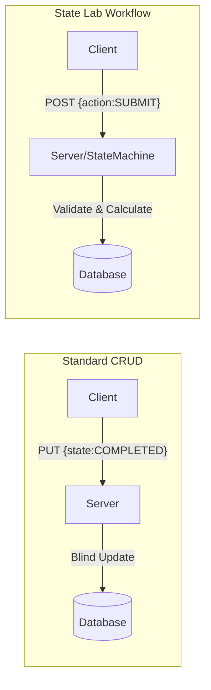

# State Lab: Domain Workflow & UI Coordination

A demonstration platform for exploring **Server-Authoritative State Management**, **Optimistic Concurrency**, and **Workflow Enforcement**.

## What This Lab Demonstrates

This project is a focused laboratory for exploring the coordination between backend state machines and frontend UIs. It demonstrates:

- **Explicit Domain State**: State is modeled as a first-class citizen on the server, not just a string in a database.
- **Centralized Transition Rules**: Lifecycle logic is encapsulated in a backend state machine, ensuring rules are enforced regardless of the client.
- **Optimistic Concurrency**: Using Versioning and ETag/If-Match headers to prevent "lost updates" in multi-user environments.
- **UI Derived from Truth**: The frontend does not infer workflow rules; it renders lifecycle actions directly from the `allowedActions` provided by the server.
- **Immutable Auditability**: Every state change is recorded as a discrete event, providing a perfect history of "who, what, and why."

## Demonstration Mode: Visible Invalid Actions

In this lab, **all lifecycle action buttons are intentionally visible**, even when an action is invalid for the current state. 

In a production system, invalid actions would typically be hidden or disabled based on permissions and state.  
**Here, they remain visible to prove that the backend is the ultimate authority.**

If an invalid action is attempted:
- The request is sent to the server.
- The state machine rejects the transition.
- The UI displays the resulting error.

This design makes state enforcement *observable*, not implicit.

## How State Works (Backend vs Frontend)

### Backend (Spring Boot): Domain State + Enforcement
The server is the **Single Source of Truth**.
- **Lifecycle Authority**: Persists the durable `state` field in PostgreSQL.
- **Transition Rules**: A centralized State Machine validates intents and calculates next states.
- **Guard Rails**: Enforces business invariants (e.g., "Notes are required for rejection").
- **Concurrency Control**: Uses JPA `@Version` to prevent lost updates, exposed via ETag headers.
- **Audit Log**: Records every state change as an immutable `WorkOrderEvent`.

### Frontend (Next.js): UI State Derived from Server Truth
The client is a **Thin Reflection** of the server state.
- **Server Sync**: Fetches state on-demand; does not duplicate workflow logic.
- **Action Rendering**: UI buttons are rendered based on `allowedActions` sent by the server.
- **Transient Experience**: Orchestrates the "Notes" prompts and loading transitions.
- **Conflict Reconciliation**: Detects `409 Conflict` and prompts users to refresh stale data.

### The Contract Between Them

**GET /work-orders/{id}**
- Returns: WorkOrder + `allowedActions` + `Version` (ETag).

**POST /work-orders/{id}/transition**
- Requires: `If-Match: <version>`.
- Applies: `{ action, notes }`.
- Returns: Updated WorkOrder + new `ETag`.
- Returns: **409 Conflict** if the ETag is stale.
+
+## What This Lab Intentionally Does NOT Include
+
+To keep the focus strictly on state coordination and concurrency, the following are omitted by design:
+
+- **Authentication/Authorization**: All actions are "anonymous" for the purpose of the lab.
+- **Background Jobs**: All transitions are synchronous and immediate.
+- **Asynchronous Messaging**: No Kafka, RabbitMQ, or event-driven microservices.
+- **Reactive Streams**: Uses standard Spring Web patterns rather than WebFlux/Project Reactor.
+- **AI / RAG**: This is a deterministic system; no LLMs or probabilistic logic are used.
+- **Complex UI State**: No Redux or heavy client-side state management; the UI is a thin reflection of the server.

## Why not CRUD? (Transition vs. PUT)

In most "simple CRUD" apps, updating a status looks like this:
`PUT /work-orders/123 { "state": "COMPLETED" }`

**Why this is dangerous in workflow systems (Insurance, Banking, Forms):**
1. **Bypassing Invariants**: A user could "jump" from `DRAFT` to `COMPLETED`, skipping essential steps like `APPROVAL`.
2. **Implicit Logic**: The business rules for *when* a state can change are buried in the UI or scattered across controller logic.
3. **Audit Loss**: You know the state changed, but you don't know the *intent* (the "Action") that caused it.

**The State Lab way (Server-Authoritative Intent):**
Instead of the client telling the server what the state *is*, the client tells the server what it wants to *do*:
`POST /work-orders/123/transition { "action": "SUBMIT" }`



**Result:** The server acts as a gatekeeper. If the transition is invalid, the server rejects it. If valid, the server calculates the next state and records the intent in the audit log.


---

## Prerequisites
- **Docker Desktop**
- **Java 21** (or use the provided Maven wrapper)
- **Node.js 18+**

---

## Setup & Running

### 1. Infrastructure (Database)
Start PostgreSQL and pgAdmin first:
```bash
cd docker
docker-compose up -d
```
- **Postgres**: localhost:5432
- **pgAdmin**: http://localhost:5050 (admin@statelab.local / admin123)

### 2. Backend (Spring Boot)
```bash
cd backend/statelab
./mvnw spring-boot:run
```
Service runs at: http://localhost:8080

### 3. Frontend (Next.js)
```bash
cd frontend/state-lab
npm install
npm run dev
```
UI runs at: http://localhost:3000

---

## How to Interpret the Lab

### The Concurrency Test (The Main Event)
1. Find a Work Order in `SUBMITTED` state.
2. Open that same URL in **two browser tabs** (Side-by-side).
3. In **Tab 1**, click **Approve**.
4. In **Tab 2**, click **Reject** and provide a note.
5. **Observation**: Tab 2 will show a "Concurrency Conflict" modal. This proves the `If-Match` header successfully prevented an update based on stale state.

### The Guard Test
1. Create a new Work Order.
2. From the list, go to details.
3. Click **Submit**.
4. Now in `SUBMITTED` state, try to click **Reject**.
5. Observe the prompt for notes. Cancel it. No change happens.
6. Observe that you cannot see "Mark Complete" yet, because the state machine doesn't allow it until it's `APPROVED`.

---

## Dockerization

You can run the entire stack (App + DB) in Docker.

### 1. Build Artifacts
```bash
# Backend
cd backend/statelab
./mvnw package -DskipTests

# Frontend
cd ../../frontend/state-lab
# Ensure you set the backend URL for the build if needed
npm run build
```

### 2. Create Dockerfiles
(I have already placed a unified `docker-compose.yml` in the root and individual Dockerfiles in each directory).

### 3. Run Everything
```bash
docker-compose up --build
```
